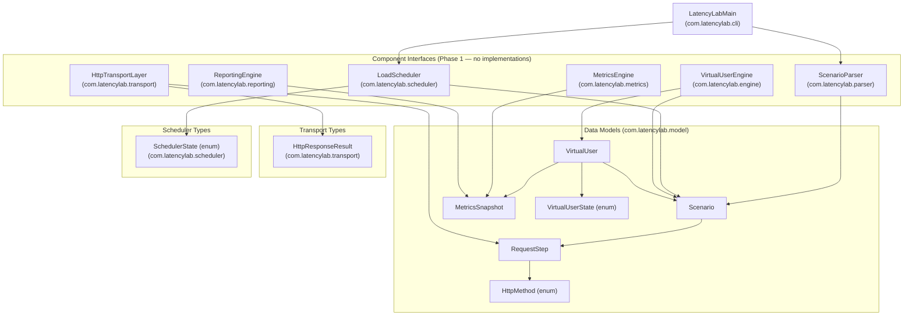

# Design Document — LatencyLab Phase 1: Architecture & Project Setup

## Overview

Phase 1 establishes the complete structural foundation for LatencyLab: a Java 21 Maven project with a clean package hierarchy, immutable data models, interface-based component abstractions, a CLI entry point skeleton, and a working logging and build-verification layer. No runtime execution logic is implemented — the deliverable is a compilable, testable scaffold that all subsequent phases build upon.

The design follows three guiding principles:

1. **Interface-first** — every major subsystem is defined as a Java interface; concrete implementations arrive in later phases.
2. **Immutable data** — all domain objects are Java records with compact-constructor validation; no mutable state in the model layer.
3. **Build correctness as a first-class concern** — `mvn verify` must exit `BUILD SUCCESS` with a non-zero test count from day one.

---

## Architecture

### Component Diagram



### Data Flow (Future Phases — established by Phase 1 contracts)

```
YAML file
    │
    ▼
ScenarioParser.parse(filePath) ──► Scenario
                                       │
                                       ▼
                              LoadScheduler.start(scenario)
                                       │
                                       ▼
                         VirtualUserEngine.initialize(scenario, n)
                                       │
                                       ▼
                              List<VirtualUser>
                                       │
                                       ▼
                         VirtualUserEngine.execute(users, scenario)
                                       │  (per step, per user)
                                       ▼
                         HttpTransportLayer.execute(step) ──► HttpResponseResult
                                       │
                                       ▼
                         MetricsEngine.record(latencyNanos, success)
                                       │
                                       ▼
                         MetricsEngine.snapshot() ──► MetricsSnapshot
                                       │
                                       ▼
                         ReportingEngine.printConsole / writeCsv / writeJson
```

---

## Components and Interfaces

### `com.latencylab.cli` — CLI Entry Point

**`LatencyLabMain`** (class)

The sole entry point. Responsibilities in Phase 1:
- Obtain an SLF4J logger via `LoggerFactory.getLogger(LatencyLabMain.class)`.
- Log a startup banner at INFO level including the string `"LatencyLab"`.
- Read the `Implementation-Version` attribute from the JAR manifest; log it at INFO level, falling back to `"unknown"` if absent or unreadable.
- Parse `args[]` for `--config <path>`: if present, log the path at INFO; if `--config` is the last token with no following value, log an ERROR and call `System.exit(1)`.
- With no arguments, exit normally (code 0).
- All logging is wrapped so that any logging exception does not propagate to the JVM.

```
main(String[] args)
  ├── log INFO: "LatencyLab starting — version <version>"
  ├── if args contains "--config"
  │     ├── if next token exists → log INFO: "Config path: <path>"
  │     └── else → log ERROR: "Missing path after --config" → System.exit(1)
  └── exit 0
```

---

### `com.latencylab.parser` — Scenario Parsing

**`ScenarioParser`** (interface)

```java
public interface ScenarioParser {
    Scenario parse(String filePath);
    boolean validate(Scenario scenario);
}
```

`parse` reads a YAML/JSON file at `filePath` and returns a populated `Scenario`. `validate` checks structural correctness of an already-parsed `Scenario` and returns `true` if valid.

---

### `com.latencylab.scheduler` — Load Scheduling

**`LoadScheduler`** (interface)

```java
public interface LoadScheduler {
    void start(Scenario scenario);
    void pause();
    void stop();
    SchedulerState getState();
}
```

**`SchedulerState`** (enum)

```java
public enum SchedulerState {
    IDLE, RUNNING, PAUSED, STOPPED
}
```

---

### `com.latencylab.engine` — Virtual User Engine

**`VirtualUserEngine`** (interface)

```java
public interface VirtualUserEngine {
    List<VirtualUser> initialize(Scenario scenario, int userCount);
    void execute(List<VirtualUser> users, Scenario scenario);
}
```

`initialize` creates a pool of `VirtualUser` instances in `IDLE` state. `execute` drives them concurrently through the scenario (implementation deferred to Phase 3).

---

### `com.latencylab.transport` — HTTP Transport

**`HttpTransportLayer`** (interface)

```java
public interface HttpTransportLayer {
    HttpResponseResult execute(RequestStep step);
}
```

**`HttpResponseResult`** (record)

```java
public record HttpResponseResult(
    int statusCode,
    String responseBody,
    long latencyNanos
) {}
```

`latencyNanos` is measured with `System.nanoTime()` deltas. `responseBody` may be null for responses with no body.

---

### `com.latencylab.metrics` — Metrics Engine

**`MetricsEngine`** (interface)

```java
public interface MetricsEngine {
    void record(long latencyNanos, boolean success);
    MetricsSnapshot snapshot();
}
```

`record` captures a single request outcome. `snapshot` produces a point-in-time `MetricsSnapshot` from all accumulated data.

---

### `com.latencylab.reporting` — Reporting Engine

**`ReportingEngine`** (interface)

```java
public interface ReportingEngine {
    void printConsole(MetricsSnapshot snapshot);
    void writeCsv(MetricsSnapshot snapshot, String outputPath);
    void writeJson(MetricsSnapshot snapshot, String outputPath);
}
```

---

## Data Models

All models are Java records in `com.latencylab.model`. Compact constructors enforce invariants at construction time, throwing `IllegalArgumentException` for violations.

### `VirtualUserState` (enum)

```java
public enum VirtualUserState {
    IDLE, RUNNING, COMPLETED, FAILED
}
```

### `HttpMethod` (enum)

```java
public enum HttpMethod {
    GET, POST, PUT, PATCH, DELETE
}
```

### `RequestStep` (record)

```java
public record RequestStep(
    String name,
    HttpMethod method,
    String endpoint,
    String body,                    // nullable
    Map<String, String> headers,    // non-null, may be empty
    int timeoutMillis               // [1, 300000]
) {
    public RequestStep {
        Objects.requireNonNull(name, "name must not be null");
        Objects.requireNonNull(method, "method must not be null");
        Objects.requireNonNull(endpoint, "endpoint must not be null");
        Objects.requireNonNull(headers, "headers must not be null");
        if (timeoutMillis < 1 || timeoutMillis > 300_000)
            throw new IllegalArgumentException(
                "timeoutMillis must be in [1, 300000], got: " + timeoutMillis);
        headers = Map.copyOf(headers); // defensive copy → immutable
    }
}
```

### `Scenario` (record)

```java
public record Scenario(
    String testName,
    List<RequestStep> steps,    // non-null, non-empty
    int rampUpSeconds,          // [0, 3600]
    int durationSeconds,        // [1, 86400]
    int userCount               // [1, 100000]
) {
    public Scenario {
        Objects.requireNonNull(testName, "testName must not be null");
        Objects.requireNonNull(steps, "steps must not be null");
        if (steps.isEmpty())
            throw new IllegalArgumentException("steps must not be empty");
        if (rampUpSeconds < 0 || rampUpSeconds > 3_600)
            throw new IllegalArgumentException(
                "rampUpSeconds must be in [0, 3600], got: " + rampUpSeconds);
        if (durationSeconds < 1 || durationSeconds > 86_400)
            throw new IllegalArgumentException(
                "durationSeconds must be in [1, 86400], got: " + durationSeconds);
        if (userCount < 1 || userCount > 100_000)
            throw new IllegalArgumentException(
                "userCount must be in [1, 100000], got: " + userCount);
        steps = List.copyOf(steps); // defensive copy → immutable
    }
}
```

### `MetricsSnapshot` (record)

```java
public record MetricsSnapshot(
    long totalRequests,
    long successfulRequests,
    long failedRequests,
    long avgLatencyNanos,
    long minLatencyNanos,
    long maxLatencyNanos,
    long p50LatencyNanos,
    long p95LatencyNanos,
    long p99LatencyNanos,
    double requestsPerSecond,
    long snapshotTimestamp       // System.nanoTime()
) {
    public MetricsSnapshot {
        if (successfulRequests + failedRequests > totalRequests)
            throw new IllegalArgumentException(
                "successfulRequests + failedRequests must be <= totalRequests");
    }
}
```

### `VirtualUser` (record)

```java
public record VirtualUser(
    String userId,
    VirtualUserState state,
    Scenario activeScenario,     // nullable — null when state is IDLE
    MetricsSnapshot metricsSnapshot  // nullable — null when no metrics recorded
) {
    public VirtualUser {
        Objects.requireNonNull(userId, "userId must not be null");
        Objects.requireNonNull(state, "state must not be null");
    }
}
```

---

## Correctness Properties

*A property is a characteristic or behavior that should hold true across all valid executions of a system — essentially, a formal statement about what the system should do. Properties serve as the bridge between human-readable specifications and machine-verifiable correctness guarantees.*

This feature involves pure data model logic (record construction, compact-constructor validation, immutability invariants) — an ideal fit for property-based testing. The properties below are derived from the acceptance criteria in Requirements 3 and 4.

The chosen PBT library is **[jqwik](https://jqwik.net/)** (JUnit 5 compatible, idiomatic Java PBT). Each property test runs a minimum of 100 iterations.

---

### Property 1: RequestStep construction preserves all field values

*For any* valid combination of `name`, `method`, `endpoint`, `body`, `headers`, and `timeoutMillis` (within [1, 300000]), constructing a `RequestStep` and reading back each accessor SHALL return the exact value supplied at construction.

**Validates: Requirements 3.3**

---

### Property 2: RequestStep rejects out-of-range timeoutMillis

*For any* `timeoutMillis` value outside the range [1, 300000] (i.e., ≤ 0 or > 300000), constructing a `RequestStep` SHALL throw an `IllegalArgumentException`.

**Validates: Requirements 3.3**

---

### Property 3: Scenario construction preserves all field values

*For any* valid `testName`, non-empty `steps` list, `rampUpSeconds` in [0, 3600], `durationSeconds` in [1, 86400], and `userCount` in [1, 100000], constructing a `Scenario` and reading back each accessor SHALL return the exact value supplied at construction.

**Validates: Requirements 3.2**

---

### Property 4: Scenario rejects invalid numeric bounds

*For any* `Scenario` construction attempt where any numeric field violates its declared range (`rampUpSeconds` < 0 or > 3600, `durationSeconds` < 1 or > 86400, `userCount` < 1 or > 100000), the constructor SHALL throw an `IllegalArgumentException`.

**Validates: Requirements 3.2**

---

### Property 5: MetricsSnapshot request count invariant

*For any* `MetricsSnapshot` where `successfulRequests + failedRequests > totalRequests`, construction SHALL throw an `IllegalArgumentException`. Conversely, *for any* values where `successfulRequests + failedRequests <= totalRequests`, construction SHALL succeed.

**Validates: Requirements 3.4**

---

### Property 6: MetricsSnapshot construction preserves all field values

*For any* valid `MetricsSnapshot` (satisfying the count invariant), reading back each accessor SHALL return the exact value supplied at construction.

**Validates: Requirements 3.4**

---

### Property 7: VirtualUser construction preserves all field values

*For any* valid `userId`, `state`, and nullable `activeScenario` / `metricsSnapshot`, constructing a `VirtualUser` and reading back each accessor SHALL return the exact value supplied at construction.

**Validates: Requirements 3.1**

---

### Property 8: Record immutability — steps list is defensively copied

*For any* `Scenario` constructed with a mutable `List<RequestStep>`, mutating the original list after construction SHALL NOT change the list returned by `scenario.steps()`.

**Validates: Requirements 3.2** (immutability implied by record + defensive copy)

---

### Property 9: Record immutability — headers map is defensively copied

*For any* `RequestStep` constructed with a mutable `Map<String, String>`, mutating the original map after construction SHALL NOT change the map returned by `step.headers()`.

**Validates: Requirements 3.3** (immutability implied by record + defensive copy)

---

**Property Reflection — Redundancy Check:**

- Properties 1 and 3 both test "construction preserves values" but for different types with different fields — kept separate.
- Properties 2 and 4 both test "invalid bounds throw" but for different types — kept separate.
- Properties 5 and 6 cover different aspects of `MetricsSnapshot` (invariant enforcement vs. value preservation) — both needed.
- Properties 8 and 9 test the same immutability pattern but on different types/fields — kept separate as they exercise different defensive-copy paths.
- No redundancy identified; all 9 properties provide unique validation value.

---

## Error Handling

Phase 1 has minimal runtime error handling since no execution logic is implemented. The defined error contracts are:

| Location | Condition | Behavior |
|---|---|---|
| Record compact constructors | Null required field | `NullPointerException` via `Objects.requireNonNull` |
| Record compact constructors | Out-of-range numeric field | `IllegalArgumentException` with descriptive message |
| Record compact constructors | Empty `steps` list | `IllegalArgumentException` |
| Record compact constructors | `successfulRequests + failedRequests > totalRequests` | `IllegalArgumentException` |
| `LatencyLabMain` | `--config` with no following path | Log ERROR, `System.exit(1)` |
| `LatencyLabMain` | Any logging exception | Swallow; exit 0 |
| `LatencyLabMain` | Manifest unreadable / attribute absent | Log `"unknown"` as version fallback |

Interface methods declare no checked exceptions in Phase 1. Implementations introduced in later phases may add `throws` clauses as needed.

---

## Testing Strategy

### Unit Tests (JUnit 5)

One test class per production type, mirroring the package structure under `src/test/java`.

| Test Class | Package | What It Verifies |
|---|---|---|
| `VirtualUserTest` | `com.latencylab.model` | Construction with valid args; accessor round-trip; null `userId` throws NPE; null `state` throws NPE |
| `ScenarioTest` | `com.latencylab.model` | Construction with valid args; accessor round-trip; empty `steps` throws IAE; out-of-range numerics throw IAE; steps list is defensively copied |
| `RequestStepTest` | `com.latencylab.model` | Construction with valid args; accessor round-trip; null required fields throw NPE; `timeoutMillis` boundary values (1 and 300000 valid; 0 and 300001 invalid); headers map is defensively copied |
| `MetricsSnapshotTest` | `com.latencylab.model` | Construction with valid args; accessor round-trip; `successfulRequests + failedRequests > totalRequests` throws IAE; equality at boundary (sum == total is valid) |
| `InterfacePresenceTest` | `com.latencylab` | `Class.forName(...)` for all 6 interfaces succeeds without `ClassNotFoundException` |
| `LatencyLabMainTest` | `com.latencylab.cli` | No-args execution logs without throwing; `--config path` logs path; `--config` with no path triggers exit code 1 (via `SecurityManager` or process-level test) |

### Property-Based Tests (jqwik)

One property test class per data model, co-located with the unit test class.

| Test Class | Properties Covered |
|---|---|
| `RequestStepPropertyTest` | Properties 1, 2, 9 |
| `ScenarioPropertyTest` | Properties 3, 4, 8 |
| `MetricsSnapshotPropertyTest` | Properties 5, 6 |
| `VirtualUserPropertyTest` | Property 7 |

**Configuration:**
- Each `@Property` method runs minimum 100 tries (`@Property(tries = 100)`).
- Each test is tagged with a comment: `// Feature: latencylab-phase1-setup, Property N: <property_text>`
- Generators use jqwik's built-in `@ForAll` with `@StringNotEmpty`, `@IntRange`, `@LongRange`, and custom `@Provide` arbitraries for enums and nested records.

### Build Verification

- `mvn verify` on a clean checkout exits `BUILD SUCCESS`.
- Maven Surefire configured with `<failIfNoTests>true</failIfNoTests>`.
- `maven-compiler-plugin` configured with `-Xlint:unchecked -Xlint:deprecation`.

---

## Maven `pom.xml` Structure

### Key Sections

```xml
<groupId>com.latencylab</groupId>
<artifactId>latencylab</artifactId>
<version>0.1.0-SNAPSHOT</version>
<packaging>jar</packaging>

<properties>
  <java.version>21</java.version>
  <maven.compiler.source>21</maven.compiler.source>
  <maven.compiler.target>21</maven.compiler.target>
</properties>
```

### Dependencies

| Dependency | Group | Artifact | Scope |
|---|---|---|---|
| OkHttp | `com.squareup.okhttp3` | `okhttp` | compile |
| Jackson YAML | `com.fasterxml.jackson.dataformat` | `jackson-dataformat-yaml` | compile |
| SLF4J API | `org.slf4j` | `slf4j-api` | compile |
| Logback Classic | `ch.qos.logback` | `logback-classic` | runtime |
| JUnit 5 | `org.junit.jupiter` | `junit-jupiter` | test |
| jqwik | `net.jqwik` | `jqwik` | test |

### Plugins

| Plugin | Purpose | Key Config |
|---|---|---|
| `maven-compiler-plugin` | Java 21 compilation | `<compilerArgs>`: `-Xlint:unchecked`, `-Xlint:deprecation` |
| `maven-surefire-plugin` | Test execution | `<failIfNoTests>true</failIfNoTests>` |
| `maven-shade-plugin` or `maven-assembly-plugin` | Uber-JAR packaging | `mainClass`: `com.latencylab.cli.LatencyLabMain`; `Implementation-Version`: `${project.version}` in manifest |

The `maven-shade-plugin` is preferred for uber-JAR creation. The manifest must include:
```
Main-Class: com.latencylab.cli.LatencyLabMain
Implementation-Version: ${project.version}
```

---

## Logback Configuration Design

**File:** `src/main/resources/logback.xml`

```xml
<configuration>

  <appender name="CONSOLE" class="ch.qos.logback.core.ConsoleAppender">
    <encoder>
      <pattern>%d{HH:mm:ss.SSS} [%thread] %-5level %logger{36} - %msg%n</pattern>
    </encoder>
  </appender>

  <logger name="com.latencylab" level="DEBUG" />

  <root level="INFO">
    <appender-ref ref="CONSOLE" />
  </root>

</configuration>
```

Design decisions:
- A single named appender `CONSOLE` satisfies Requirement 6.2 and 6.6.
- Root level `INFO` satisfies Requirement 6.3; `com.latencylab` override to `DEBUG` satisfies Requirement 6.4.
- The pattern exactly matches the spec: `%d{HH:mm:ss.SSS} [%thread] %-5level %logger{36} - %msg%n`.
- No file appender in Phase 1 — console only.

---

## Complete Type Inventory

| Type | Kind | Package | Phase 1 Status |
|---|---|---|---|
| `LatencyLabMain` | class | `com.latencylab.cli` | Implemented (skeleton) |
| `VirtualUser` | record | `com.latencylab.model` | Implemented |
| `Scenario` | record | `com.latencylab.model` | Implemented |
| `RequestStep` | record | `com.latencylab.model` | Implemented |
| `MetricsSnapshot` | record | `com.latencylab.model` | Implemented |
| `VirtualUserState` | enum | `com.latencylab.model` | Implemented |
| `HttpMethod` | enum | `com.latencylab.model` | Implemented |
| `ScenarioParser` | interface | `com.latencylab.parser` | Defined (no impl) |
| `LoadScheduler` | interface | `com.latencylab.scheduler` | Defined (no impl) |
| `SchedulerState` | enum | `com.latencylab.scheduler` | Implemented |
| `VirtualUserEngine` | interface | `com.latencylab.engine` | Defined (no impl) |
| `HttpTransportLayer` | interface | `com.latencylab.transport` | Defined (no impl) |
| `HttpResponseResult` | record | `com.latencylab.transport` | Implemented |
| `MetricsEngine` | interface | `com.latencylab.metrics` | Defined (no impl) |
| `ReportingEngine` | interface | `com.latencylab.reporting` | Defined (no impl) |
