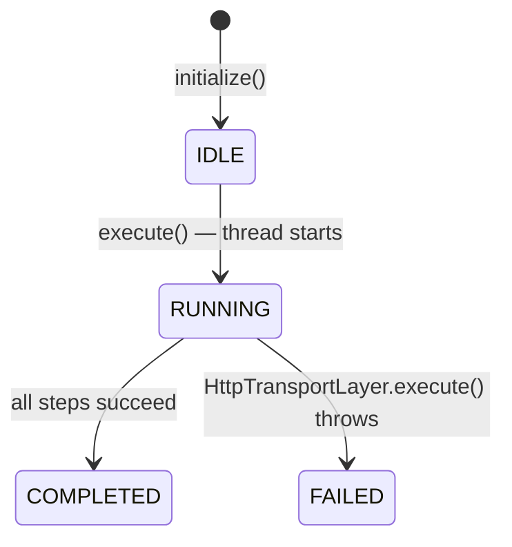

# Design Document — LatencyLab Phase 2: HTTP Execution Engine

## Overview

Phase 2 delivers the two concrete runtime implementations that bring the Phase 1 interface contracts to life:

- **`OkHttpTransportLayer`** (`com.latencylab.transport`) — implements `HttpTransportLayer` using OkHttp 4.12.0 as the underlying HTTP client. Responsible for URL construction, HTTP method/body mapping, per-request timeout application, latency measurement via `System.nanoTime()`, and graceful error handling.
- **`DefaultVirtualUserEngine`** (`com.latencylab.engine`) — implements `VirtualUserEngine`. Initializes a pool of `VirtualUser` instances and drives them concurrently through a `Scenario`'s `RequestStep` list using Java 21 virtual threads (Project Loom).

No metrics aggregation or reporting is implemented in this phase. The `HttpResponseResult` values produced by the transport layer are captured per step but not yet aggregated — that arrives in Phase 4.

### Design Principles

1. **Single shared OkHttpClient** — constructed once, held for the lifetime of `OkHttpTransportLayer`, and released only on explicit `close()`.
2. **Per-request timeout override** — the client-level read timeout is overridden per call using `OkHttpClient.newBuilder()` without rebuilding the full client.
3. **Virtual thread per user** — `DefaultVirtualUserEngine` launches one `Thread.ofVirtual()` per `VirtualUser`, joins all threads before returning, and isolates per-user failures.
4. **Immutable state transitions** — `VirtualUser` is a record; state transitions produce new instances rather than mutating in place.

---

## Architecture

### Component Diagram

```mermaid
graph TD
    subgraph Phase1["Phase 1 — Interfaces & Models"]
        HTL["«interface»\nHttpTransportLayer\n(com.latencylab.transport)"]
        VUE["«interface»\nVirtualUserEngine\n(com.latencylab.engine)"]
        RS["RequestStep\n(com.latencylab.model)"]
        SC["Scenario\n(com.latencylab.model)"]
        VU["VirtualUser\n(com.latencylab.model)"]
        HRR["HttpResponseResult\n(com.latencylab.transport)"]
        HM["HttpMethod (enum)"]
        VUS["VirtualUserState (enum)"]
    end

    subgraph Phase2["Phase 2 — Concrete Implementations"]
        OHTL["OkHttpTransportLayer\nimplements HttpTransportLayer, Closeable\n(com.latencylab.transport)"]
        DVUE["DefaultVirtualUserEngine\nimplements VirtualUserEngine\n(com.latencylab.engine)"]
    end

    subgraph OkHttp["OkHttp 4.12.0 (external)"]
        OC["OkHttpClient"]
        CP["ConnectionPool"]
        RB["Request.Builder"]
        RESP["Response"]
    end

    OHTL -->|implements| HTL
    DVUE -->|implements| VUE

    DVUE -->|calls execute(step)| OHTL
    DVUE -->|creates/transitions| VU
    DVUE -->|reads steps from| SC
    DVUE -->|reads steps from| RS

    OHTL -->|constructs| RB
    OHTL -->|dispatches via| OC
    OC -->|uses| CP
    OC -->|returns| RESP
    OHTL -->|wraps result in| HRR
    OHTL -->|reads method from| HM
    OHTL -->|reads fields from| RS

    VU -->|has state| VUS
    VU -->|has scenario| SC
```

### Data Flow

```
Scenario (testName, steps, rampUpSeconds, durationSeconds, userCount)
    │
    ▼
DefaultVirtualUserEngine.initialize(scenario, userCount)
    │  creates userCount VirtualUser instances (state=IDLE)
    ▼
List<VirtualUser>
    │
    ▼
DefaultVirtualUserEngine.execute(users, scenario)
    │  launches one virtual thread per VirtualUser
    │
    ├─ [Virtual Thread for user-1] ──────────────────────────────────────┐
    │    state: IDLE → RUNNING                                           │
    │    for each RequestStep in scenario.steps():                       │
    │        OkHttpTransportLayer.execute(step)                          │
    │            │                                                       │
    │            ├─ construct URL: baseUrl + "/" + endpoint              │
    │            ├─ map HttpMethod → OkHttp Request                      │
    │            ├─ apply headers from RequestStep.headers               │
    │            ├─ apply per-request timeout                            │
    │            ├─ startNanos = System.nanoTime()                       │
    │            ├─ OkHttpClient.newCall(request).execute()              │
    │            ├─ endNanos = System.nanoTime()                         │
    │            └─ return HttpResponseResult(statusCode, body, endNanos-startNanos)
    │    state: RUNNING → COMPLETED (or FAILED on exception)            │
    └────────────────────────────────────────────────────────────────────┘
    │
    ├─ [Virtual Thread for user-2] ... (same pattern)
    │
    ▼  (all threads joined)
execute() returns
```

---

## Components and Interfaces

### `OkHttpTransportLayer` (`com.latencylab.transport`)

#### Class Declaration

```java
public class OkHttpTransportLayer implements HttpTransportLayer, java.io.Closeable {
    private static final Logger log = LoggerFactory.getLogger(OkHttpTransportLayer.class);
    private static final MediaType JSON = MediaType.get("application/json; charset=utf-8");

    private final String baseUrl;          // normalized: trailing slash stripped
    private final OkHttpClient client;     // single shared instance
    private volatile boolean closed = false;

    public OkHttpTransportLayer(String baseUrl) { ... }

    @Override
    public HttpResponseResult execute(RequestStep step) { ... }

    @Override
    public void close() { ... }

    private String buildUrl(String endpoint) { ... }
    private Request buildRequest(RequestStep step, String url) { ... }
    private RequestBody buildBody(String body) { ... }
}
```

#### Constructor

```
OkHttpTransportLayer(String baseUrl)
  ├── validate baseUrl: null → throw IllegalArgumentException("baseUrl must not be null")
  ├── validate baseUrl: blank → throw IllegalArgumentException("baseUrl must not be blank")
  ├── normalize: this.baseUrl = baseUrl.stripTrailing('/') equivalent (strip trailing slashes)
  └── build OkHttpClient:
        ConnectionPool pool = new ConnectionPool(200, 5, TimeUnit.MINUTES)
        OkHttpClient client = new OkHttpClient.Builder()
            .connectionPool(pool)
            .connectTimeout(10, TimeUnit.SECONDS)
            .readTimeout(30, TimeUnit.SECONDS)
            .writeTimeout(10, TimeUnit.SECONDS)
            .build()
```

#### `execute(RequestStep step)` Flow

```
execute(RequestStep step)
  ├── Objects.requireNonNull(step, "step must not be null")
  ├── if (closed) throw IllegalStateException("OkHttpTransportLayer has been closed")
  ├── url = buildUrl(step.endpoint())
  ├── request = buildRequest(step, url)
  ├── log DEBUG: "Dispatching [step.name()] method=step.method() url=url"
  ├── apply per-request timeout:
  │     OkHttpClient callClient = client.newBuilder()
  │         .readTimeout(step.timeoutMillis(), TimeUnit.MILLISECONDS)
  │         .build()
  ├── long startNanos = System.nanoTime()
  ├── try:
  │     Response response = callClient.newCall(request).execute()
  │     long endNanos = System.nanoTime()
  │     int statusCode = response.code()
  │     String body = extractBody(response.body())
  │     log DEBUG: "Completed [step.name()] status=statusCode latencyNanos=(endNanos-startNanos)"
  │     return new HttpResponseResult(statusCode, body, endNanos - startNanos)
  └── catch (IOException e):
        long endNanos = System.nanoTime()
        log DEBUG: "Failed [step.name()] error=e.getMessage() latencyNanos=(endNanos-startNanos)"
        return new HttpResponseResult(0, null, endNanos - startNanos)
```

**Body extraction rule:** `response.body()` is null or `contentLength() == 0` → return `null`; otherwise read as UTF-8 string.

#### `buildUrl(String endpoint)` Logic

```
buildUrl(endpoint):
  normalized = endpoint.startsWith("/") ? endpoint.substring(1) : endpoint
  return baseUrl + "/" + normalized
```

This guarantees exactly one `/` between `baseUrl` (already stripped of trailing slashes in constructor) and `endpoint` (stripped of leading slash here).

#### `buildRequest(RequestStep step, String url)` Logic

```
buildRequest(step, url):
  Request.Builder builder = new Request.Builder().url(url)

  // Apply headers from RequestStep
  for each (key, value) in step.headers():
      builder.addHeader(key, value)

  // Determine effective Content-Type
  boolean hasContentType = step.headers().containsKey("Content-Type")

  switch step.method():
    GET    → builder.get()
    POST   → builder.post(buildBody(step.body()))
               if step.body() != null && !step.body().isEmpty() && !hasContentType:
                   builder.addHeader("Content-Type", "application/json; charset=utf-8")
    PUT    → builder.put(buildBody(step.body()))
               (same Content-Type injection rule as POST)
    PATCH  → builder.patch(buildBody(step.body()))
               (same Content-Type injection rule as POST)
    DELETE → step.body() != null
               ? builder.delete(buildBody(step.body()))
               : builder.delete()
               (Content-Type injection only if body non-null and not already set)

  return builder.build()
```

**Content-Type injection rule (Requirement 6.6):**
- Body non-null and non-empty AND no existing `Content-Type` in `step.headers()` → inject `application/json; charset=utf-8`
- Body null or empty → do NOT inject `Content-Type` (unless already in `step.headers()`)
- `step.headers()` already has `Content-Type` → use that value (already applied via `addHeader` loop above)

#### `buildBody(String body)` Logic

```
buildBody(body):
  if body == null:
      return RequestBody.create(new byte[0], JSON)   // zero-byte body
  return RequestBody.create(body, JSON)               // UTF-8 encoded
```

#### `close()` Logic

```
close():
  if (closed) return   // idempotent
  closed = true
  client.connectionPool().evictAll()
  client.dispatcher().executorService().shutdown()
```

---

### `DefaultVirtualUserEngine` (`com.latencylab.engine`)

#### Class Declaration

```java
public class DefaultVirtualUserEngine implements VirtualUserEngine {
    private static final Logger log = LoggerFactory.getLogger(DefaultVirtualUserEngine.class);

    private final HttpTransportLayer transport;

    public DefaultVirtualUserEngine(HttpTransportLayer transport) { ... }

    @Override
    public List<VirtualUser> initialize(Scenario scenario, int userCount) { ... }

    @Override
    public void execute(List<VirtualUser> users, Scenario scenario) { ... }

    private void runUser(VirtualUser user, Scenario scenario) { ... }
}
```

#### Constructor

```
DefaultVirtualUserEngine(HttpTransportLayer transport)
  └── Objects.requireNonNull(transport, "transport must not be null")
      this.transport = transport
```

The `HttpTransportLayer` is injected at construction time, enabling test doubles (stub/spy) to be passed in tests without a mock library.

#### `initialize(Scenario scenario, int userCount)` Logic

```
initialize(scenario, userCount):
  Objects.requireNonNull(scenario, "scenario must not be null")
  if userCount < 1: throw IllegalArgumentException("userCount must be >= 1, got: " + userCount)

  List<VirtualUser> users = new ArrayList<>(userCount)
  for i in 0..userCount-1:
      users.add(new VirtualUser(
          "user-" + (i + 1),
          VirtualUserState.IDLE,
          scenario,
          null
      ))
  return Collections.unmodifiableList(users)
```

#### `execute(List<VirtualUser> users, Scenario scenario)` Logic

```
execute(users, scenario):
  Objects.requireNonNull(users, "users must not be null")
  Objects.requireNonNull(scenario, "scenario must not be null")
  if users.isEmpty(): return

  List<Thread> threads = new ArrayList<>(users.size())
  for each user in users:
      Thread t = Thread.ofVirtual()
          .name("vuser-" + user.userId())
          .start(() -> runUser(user, scenario))
      threads.add(t)

  for each thread in threads:
      thread.join()   // blocks until all virtual threads complete
```

**Note on `thread.join()`:** `Thread.join()` throws `InterruptedException`. The implementation re-interrupts the current thread and breaks out of the join loop if interrupted, ensuring the calling thread's interrupt status is preserved.

#### `runUser(VirtualUser user, Scenario scenario)` Logic

```
runUser(user, scenario):
  // Transition to RUNNING (produces new VirtualUser record)
  VirtualUser running = new VirtualUser(user.userId(), VirtualUserState.RUNNING,
                                         user.activeScenario(), user.metricsSnapshot())
  log DEBUG: "Starting user=" + user.userId() + " steps=" + scenario.steps().size()

  try:
      for each step in scenario.steps():
          HttpResponseResult result = transport.execute(step)
          // result stored locally; not aggregated in Phase 2

      // Transition to COMPLETED
      log DEBUG: "Completed user=" + user.userId()

  catch (Exception e):
      // Transition to FAILED
      log ERROR: "Failed user=" + user.userId() + " step=" + currentStep.name() + " error=" + e
      // Exception does NOT propagate — thread terminates normally
```

**State transition note:** `VirtualUser` is an immutable record. The `runUser` method creates new `VirtualUser` instances to represent state transitions. In Phase 2, these transitioned instances are local to the thread — they are not written back to the original list (which is unmodifiable). Phase 3 will introduce a mutable state container or `AtomicReference` if cross-thread state visibility is required.

#### VirtualUserState Transition Diagram



---

## Data Models

No new data models are introduced in Phase 2. All models (`RequestStep`, `Scenario`, `VirtualUser`, `HttpResponseResult`, `VirtualUserState`, `HttpMethod`) are Phase 1 records/enums used as-is.

### Key Field Usage in Phase 2

| Model Field | Used By | Purpose |
|---|---|---|
| `RequestStep.method` | `OkHttpTransportLayer` | Selects OkHttp request builder method |
| `RequestStep.endpoint` | `OkHttpTransportLayer` | Appended to `baseUrl` to form full URL |
| `RequestStep.body` | `OkHttpTransportLayer` | Becomes OkHttp `RequestBody` |
| `RequestStep.headers` | `OkHttpTransportLayer` | Applied as HTTP headers |
| `RequestStep.timeoutMillis` | `OkHttpTransportLayer` | Per-request read timeout override |
| `Scenario.steps` | `DefaultVirtualUserEngine` | Iterated sequentially per virtual user |
| `VirtualUser.userId` | `DefaultVirtualUserEngine` | Thread name, log messages |
| `VirtualUser.state` | `DefaultVirtualUserEngine` | Tracks IDLE→RUNNING→COMPLETED/FAILED |
| `HttpResponseResult.statusCode` | Tests | Verified against MockWebServer response |
| `HttpResponseResult.latencyNanos` | Tests | Verified >= 0 |

---

## Correctness Properties

*A property is a characteristic or behavior that should hold true across all valid executions of a system — essentially, a formal statement about what the system should do. Properties serve as the bridge between human-readable specifications and machine-verifiable correctness guarantees.*

This feature involves pure URL construction logic, HTTP method/body mapping, response round-trips, and virtual user state machine transitions — all well-suited for property-based testing. The chosen PBT library is **[jqwik](https://jqwik.net/)** (already in `pom.xml` at version 1.8.4, JUnit 5 compatible). Each property test runs a minimum of 100 iterations.

**Property Reflection — Redundancy Check (performed before writing properties):**

From the prework analysis, the following consolidations apply:
- Properties about `latencyNanos >= 0` (from 5.3 and 5.5) are identical in intent — merged into one property covering both success and failure paths.
- Properties about POST/PUT/PATCH body round-trip (from 1.4 and 6.2-6.4) share the same invariant — merged into one property covering all three methods.
- Properties about `initialize` list size (3.2) and element correctness (3.3) are complementary but distinct — kept separate as they verify different aspects.
- State transition properties (4.10) and error isolation properties (4.7) are distinct — kept separate.
- URL construction (1.2) and blank baseUrl validation (2.14) are distinct — kept separate.

After reflection, 9 unique properties remain.

---

### Property 1: URL construction produces exactly one separator slash

*For any* `baseUrl` string (with or without trailing slashes) and any `endpoint` string (with or without leading slashes), the URL produced by `OkHttpTransportLayer` SHALL contain exactly one `/` at the join point between the base and the path — i.e., `buildUrl(endpoint)` equals `normalizedBase + "/" + normalizedEndpoint` where neither component has the separator character at the boundary.

**Validates: Requirements 1.2**

---

### Property 2: Request body round-trip for POST, PUT, and PATCH

*For any* non-null body string and any of the methods `POST`, `PUT`, or `PATCH`, the HTTP request received by the server SHALL contain a body equal to the original string encoded as UTF-8.

**Validates: Requirements 1.4, 6.2, 6.3, 6.4**

---

### Property 3: All request headers are forwarded to the server

*For any* `Map<String, String>` of headers supplied in `RequestStep.headers`, every key-value pair SHALL appear in the HTTP request received by the server.

**Validates: Requirements 1.6**

---

### Property 4: Response fields are preserved in HttpResponseResult

*For any* HTTP status code in [100, 599] and any response body string served by the stub server, the `HttpResponseResult` returned by `execute` SHALL have `statusCode` equal to the served status code and `responseBody` equal to the served body string.

**Validates: Requirements 1.8**

---

### Property 5: latencyNanos is non-negative for all outcomes

*For any* `RequestStep` execution — whether the request succeeds, fails with a network error, or times out — the `latencyNanos` field of the returned `HttpResponseResult` SHALL be greater than or equal to 0.

**Validates: Requirements 5.3, 5.5**

---

### Property 6: Blank baseUrl always throws IllegalArgumentException

*For any* string composed entirely of whitespace characters (spaces, tabs, newlines), constructing an `OkHttpTransportLayer` with that string as `baseUrl` SHALL throw an `IllegalArgumentException` whose message contains the word `"baseUrl"`.

**Validates: Requirements 2.14**

---

### Property 7: close() is idempotent

*For any* number of `close()` invocations (≥ 2) on the same `OkHttpTransportLayer` instance, every call after the first SHALL complete without throwing any exception.

**Validates: Requirements 2.11**

---

### Property 8: initialize returns a correctly structured list for any valid userCount

*For any* valid `userCount` in [1, 10000] and any valid `Scenario`, `initialize(scenario, userCount)` SHALL return an unmodifiable list of exactly `userCount` elements where the element at index `i` has `userId == "user-" + (i+1)`, `state == VirtualUserState.IDLE`, `activeScenario == scenario`, and `metricsSnapshot == null`.

**Validates: Requirements 3.2, 3.3**

---

### Property 9: Per-user exception isolation — failing users do not affect other users

*For any* list of virtual users where exactly one user's transport call throws an exception, all other users SHALL complete all their steps, and the execute method SHALL return normally without propagating the exception.

**Validates: Requirements 4.7**

---

## Error Handling

### `OkHttpTransportLayer` Error Handling

| Condition | Behavior |
|---|---|
| `null` `RequestStep` passed to `execute` | `NullPointerException` thrown immediately |
| `execute` called after `close()` | `IllegalStateException` thrown |
| `null` `baseUrl` in constructor | `IllegalArgumentException` with `"baseUrl"` in message |
| Blank (whitespace-only) `baseUrl` in constructor | `IllegalArgumentException` with `"baseUrl"` in message |
| Network failure (`IOException`) during `execute` | Returns `HttpResponseResult(0, null, elapsedNanos)` — never throws |
| Read timeout during `execute` | Caught as `IOException`; returns `HttpResponseResult(0, null, elapsedNanos)` |
| `close()` called multiple times | Idempotent — no exception on subsequent calls |
| Response body absent or zero-length | `responseBody` field set to `null` in `HttpResponseResult` |

### `DefaultVirtualUserEngine` Error Handling

| Condition | Behavior |
|---|---|
| `null` `Scenario` passed to `initialize` | `NullPointerException` thrown |
| `userCount < 1` passed to `initialize` | `IllegalArgumentException` thrown |
| `null` `users` list passed to `execute` | `NullPointerException` thrown |
| `null` `Scenario` passed to `execute` | `NullPointerException` thrown |
| Empty `users` list passed to `execute` | Returns immediately, no threads launched |
| `HttpTransportLayer.execute` throws for a user | Exception logged at ERROR; remaining steps for that user skipped; user state set to `FAILED`; other users unaffected |
| `Thread.join()` interrupted | Current thread re-interrupted; join loop exits; `execute` returns |

### Error Propagation Boundary

The critical design decision is that `DefaultVirtualUserEngine.execute()` is a **fire-and-join** operation: it never propagates per-user exceptions to the caller. Each virtual thread's `runUser` method catches all `Exception` subclasses, logs them, and terminates the thread normally. This ensures one misbehaving user cannot abort the entire load test.

---

## Testing Strategy

### Dual Testing Approach

Both unit tests (specific examples and edge cases) and property-based tests (universal properties across generated inputs) are used. Unit tests use JUnit 5; property tests use jqwik.

### `OkHttpTransportLayerTest` (`com.latencylab.transport`)

**Infrastructure:** OkHttp `MockWebServer` (ships with `okhttp` artifact — no additional dependency needed). `MockWebServer` is started in `@BeforeEach` and shut down in `@AfterEach`.

| Test Method | Type | What It Verifies |
|---|---|---|
| `getRequest_returnsStatusAndBody` | Example | GET → MockWebServer records GET, no body; result has correct statusCode and responseBody |
| `postRequest_withBody_sendsBody` | Example | POST with body → MockWebServer records body; result has correct statusCode |
| `postRequest_nullBody_sendsEmptyBody` | Example | POST with null body → MockWebServer records zero-byte body |
| `putRequest_withBody_sendsBody` | Example | PUT with body → correct method and body recorded |
| `patchRequest_withBody_sendsBody` | Example | PATCH with body → correct method and body recorded |
| `deleteRequest_noBody_sendsNoBody` | Example | DELETE with null body → no body in recorded request |
| `deleteRequest_withBody_sendsBody` | Example | DELETE with non-null body → body in recorded request |
| `networkFailure_returnsStatusZero` | Example | MockWebServer shut down before call → statusCode=0, responseBody=null, latencyNanos>=0 |
| `nullStep_throwsNullPointerException` | Example | execute(null) → NPE |
| `executeAfterClose_throwsIllegalStateException` | Example | close() then execute() → ISE |
| `nullBaseUrl_throwsIllegalArgumentException` | Example | new OkHttpTransportLayer(null) → IAE with "baseUrl" |
| `blankBaseUrl_throwsIllegalArgumentException` | Example | new OkHttpTransportLayer("   ") → IAE with "baseUrl" |
| `urlConstruction_property` | Property (jqwik) | Property 1: random baseUrl/endpoint combinations → exactly one slash separator |
| `bodyRoundTrip_postPutPatch_property` | Property (jqwik) | Property 2: random body strings for POST/PUT/PATCH → body received by server matches |
| `headersForwarded_property` | Property (jqwik) | Property 3: random header maps → all headers present in recorded request |
| `responseFieldsPreserved_property` | Property (jqwik) | Property 4: random status codes and bodies → HttpResponseResult fields match |
| `latencyNonNegative_property` | Property (jqwik) | Property 5: success and failure paths → latencyNanos >= 0 |
| `blankBaseUrl_property` | Property (jqwik) | Property 6: random whitespace strings → IAE with "baseUrl" |
| `closeIdempotent_property` | Property (jqwik) | Property 7: close() called N times → no exception |

### `DefaultVirtualUserEngineTest` (`com.latencylab.engine`)

**Infrastructure:** Manual stub/spy classes (no mock library). Two inner classes:
- `CountingTransport implements HttpTransportLayer` — records invocations per step name; returns a fixed `HttpResponseResult(200, "ok", 1000L)`.
- `FailingTransport implements HttpTransportLayer` — throws `RuntimeException` on every call.

| Test Method | Type | What It Verifies |
|---|---|---|
| `initialize_returnsCorrectListSize` | Example | initialize(scenario, 5) → list of 5 elements |
| `initialize_elementFields_correct` | Example | Each element has correct userId, state=IDLE, activeScenario, metricsSnapshot=null |
| `initialize_listIsUnmodifiable` | Example | Attempting add() on returned list → UnsupportedOperationException |
| `initialize_userCountZero_throwsIAE` | Example | initialize(scenario, 0) → IAE |
| `initialize_userCountNegative_throwsIAE` | Example | initialize(scenario, -1) → IAE |
| `initialize_nullScenario_throwsNPE` | Example | initialize(null, 5) → NPE |
| `execute_invokesTransportOncePerStepPerUser` | Example | 3 users × 2 steps → transport called 6 times total |
| `execute_emptyUsers_returnsImmediately` | Example | execute(emptyList, scenario) → returns without error |
| `execute_nullUsers_throwsNPE` | Example | execute(null, scenario) → NPE |
| `execute_nullScenario_throwsNPE` | Example | execute(users, null) → NPE |
| `execute_failingTransport_doesNotPropagateException` | Example | FailingTransport → execute returns normally |
| `execute_failingTransport_otherUsersComplete` | Example | 1 failing user + 2 normal users → normal users complete all steps |
| `initialize_listStructure_property` | Property (jqwik) | Property 8: random userCount [1,1000] → list size and element fields correct |
| `execute_exceptionIsolation_property` | Property (jqwik) | Property 9: random user count, one failing user → others complete |

### Property Test Configuration

- Each `@Property` method is annotated with `@Property(tries = 100)` (minimum 100 iterations).
- Each property test includes a comment: `// Feature: latencylab-phase2-http-engine, Property N: <property_text>`
- jqwik `@Provide` arbitraries are used for:
  - URL strings: `Arbitraries.strings().alpha().ofMinLength(1)` with optional trailing slash
  - Endpoint strings: `Arbitraries.strings().alpha().ofMinLength(1)` with optional leading slash
  - HTTP status codes: `Arbitraries.integers().between(100, 599)`
  - Body strings: `Arbitraries.strings().ofMinLength(0).ofMaxLength(1000)`
  - Header maps: `Arbitraries.maps(...)` with string keys/values
  - User counts: `Arbitraries.integers().between(1, 1000)`
  - Whitespace strings: `Arbitraries.strings().withChars(' ', '\t', '\n').ofMinLength(1)`

### Build Verification

- `mvn verify` on a clean checkout exits `BUILD SUCCESS`.
- `failIfNoTests=true` enforced — both test classes must contain at least one `@Test` or `@Property` method.
- jqwik tests are discovered by JUnit 5's engine via the `net.jqwik:jqwik` dependency already in `pom.xml`.

### Test Class Summary

| Test Class | Package | Location |
|---|---|---|
| `OkHttpTransportLayerTest` | `com.latencylab.transport` | `src/test/java` |
| `DefaultVirtualUserEngineTest` | `com.latencylab.engine` | `src/test/java` |

---

## Complete Type Inventory (Phase 2 Additions)

| Type | Kind | Package | Phase 2 Status |
|---|---|---|---|
| `OkHttpTransportLayer` | class | `com.latencylab.transport` | New — implements `HttpTransportLayer`, `Closeable` |
| `DefaultVirtualUserEngine` | class | `com.latencylab.engine` | New — implements `VirtualUserEngine` |
| `OkHttpTransportLayerTest` | test class | `com.latencylab.transport` | New |
| `DefaultVirtualUserEngineTest` | test class | `com.latencylab.engine` | New |
