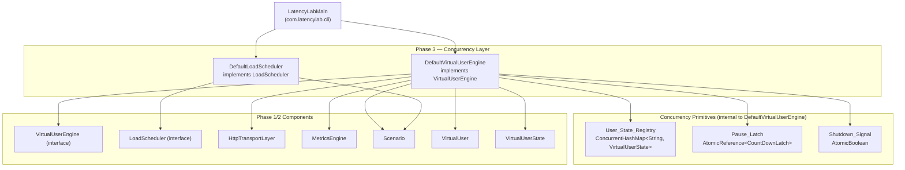
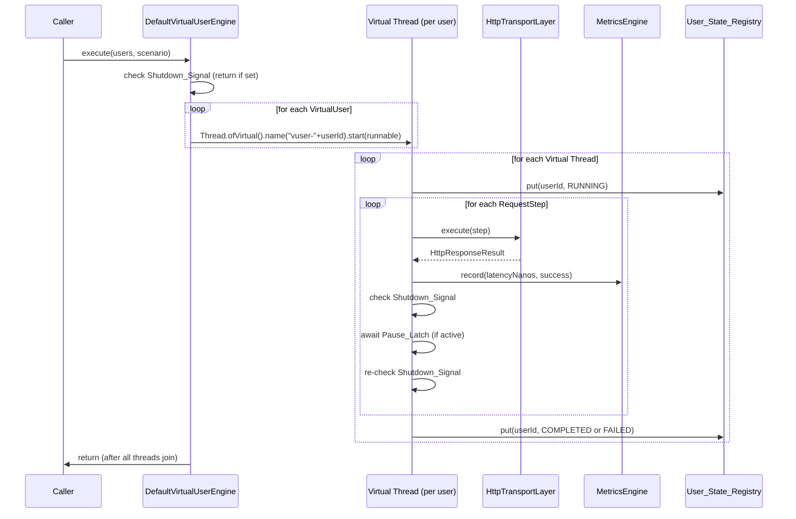
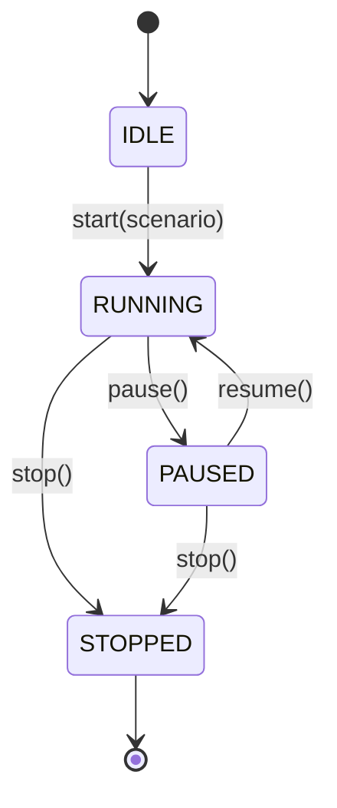

# Design Document — LatencyLab Phase 3: Virtual User Concurrency

## Overview

Phase 3 transforms the Phase 2 stub `DefaultVirtualUserEngine` into a production-grade concurrent execution harness. The deliverable is a fully wired engine that spawns one Java 21 virtual thread per virtual user, drives each user through its scenario steps sequentially, manages the full user lifecycle (IDLE → RUNNING → PAUSED → RUNNING → COMPLETED/FAILED), collects per-request metrics via `MetricsEngine`, isolates per-user failures, and shuts down gracefully. A new `DefaultLoadScheduler` implements the `LoadScheduler` interface, supporting both ramp-up and constant load profiles.

The design is guided by three principles carried forward from Phase 1:

1. **Interface-first** — `DefaultVirtualUserEngine` implements `VirtualUserEngine`; `DefaultLoadScheduler` implements `LoadScheduler`. No new interfaces are introduced.
2. **Thread-safe by construction** — shared mutable state is confined to `ConcurrentHashMap`, `AtomicBoolean`, and `CountDownLatch`; no `synchronized` blocks on hot paths.
3. **Failure isolation** — each virtual user's thread catches all exceptions internally; no user failure can propagate to another user or to the calling thread.

---

## Architecture

### Component Diagram



### Execution Flow



### Load Scheduler State Machine



---

## Components and Interfaces

### `DefaultVirtualUserEngine` (com.latencylab.engine)

The central class of Phase 3. It replaces the Phase 2 stub with a fully functional concurrent engine.

**Constructor:**

```java
public DefaultVirtualUserEngine(HttpTransportLayer transport, MetricsEngine metricsEngine)
```

- Throws `NullPointerException` if either argument is null.
- Initializes `shutdownSignal = new AtomicBoolean(false)`.
- Initializes `pauseLatch = new AtomicReference<>(new CountDownLatch(0))` (a latch with count 0 is already released — no blocking by default).
- Initializes `userStateRegistry = new ConcurrentHashMap<>()`.

**Public API (beyond `VirtualUserEngine` interface):**

```java
// Returns the current VirtualUserState for a userId; IDLE if not found
VirtualUserState getState(String userId)

// Returns an unmodifiable snapshot of the entire User_State_Registry
Map<String, VirtualUserState> getStates()

// Pauses all virtual user threads at the next inter-step boundary
void pause()

// Resumes all paused virtual user threads
void resume()

// Signals all virtual user threads to stop after their current in-flight call
void stop()
```

**Internal fields:**

| Field | Type | Purpose |
|---|---|---|
| `transport` | `HttpTransportLayer` | Executes HTTP steps |
| `metricsEngine` | `MetricsEngine` | Records per-request metrics |
| `shutdownSignal` | `AtomicBoolean` | Signals threads to stop |
| `pauseLatch` | `AtomicReference<CountDownLatch>` | Blocks threads when paused |
| `userStateRegistry` | `ConcurrentHashMap<String, VirtualUserState>` | Thread-safe state tracking |

**Thread naming:** Each virtual thread is named `"vuser-" + user.userId()` using `Thread.ofVirtual().name("vuser-" + user.userId()).start(runnable)`.

**Per-user runnable logic (pseudocode):**

```
runUser(user, scenario):
  userStateRegistry.put(userId, RUNNING)
  log.debug("Starting user {} with {} steps", userId, steps.size())
  for each step in scenario.steps():
    try:
      result = transport.execute(step)
      metricsEngine.record(result.latencyNanos(), result.statusCode() in [200,299])
    catch InterruptedException:
      Thread.currentThread().interrupt()
      userStateRegistry.put(userId, COMPLETED)
      return
    catch Exception e:
      log.error("User {} failed at step {}: {}", userId, step.name(), e)
      userStateRegistry.put(userId, FAILED)
      return
    
    if shutdownSignal.get():
      log.debug("User {} stopped", userId)
      userStateRegistry.put(userId, COMPLETED)
      return
    
    try:
      pauseLatch.get().await()
    catch InterruptedException:
      Thread.currentThread().interrupt()
      userStateRegistry.put(userId, COMPLETED)
      return
    
    if shutdownSignal.get():
      log.debug("User {} stopped after resume", userId)
      userStateRegistry.put(userId, COMPLETED)
      return
  
  log.debug("User {} completed", userId)
  userStateRegistry.put(userId, COMPLETED)
```

**Note on metrics record ordering:** `MetricsEngine.record` is called immediately after `transport.execute` returns, before the shutdown signal check. If `metricsEngine.record` throws, the exception is caught by the outer catch block, the user is marked `FAILED`, and the loop exits.

**Note on `execute` return after stop:** After all threads join, if the shutdown signal was set, log at INFO level that all virtual users have stopped.

---

### `DefaultLoadScheduler` (com.latencylab.scheduler)

A new concrete class implementing `LoadScheduler`. It manages the rate at which virtual users are activated during a test run.

**Constructor:**

```java
public DefaultLoadScheduler(Runnable activationCallback)
```

- `activationCallback` is invoked once per user activation. In production wiring this triggers a virtual user thread start; in tests it increments a counter.
- Initializes `state = new AtomicReference<>(SchedulerState.IDLE)`.

**Internal fields:**

| Field | Type | Purpose |
|---|---|---|
| `state` | `AtomicReference<SchedulerState>` | Current scheduler state |
| `activationCallback` | `Runnable` | Called once per user activation |

**`start(Scenario scenario)` logic:**

```
start(scenario):
  Objects.requireNonNull(scenario)          // NPE before state check
  if state != IDLE and state != STOPPED:
    throw IllegalStateException             // only if not null
  state.set(RUNNING)
  
  long delayMs = scenario.rampUpSeconds() == 0
      ? 0L
      : (scenario.rampUpSeconds() * 1000L) / scenario.userCount()
  
  for i in 0..userCount-1:
    if state != RUNNING: break              // stop() or pause() observed
    activationCallback.run()
    if delayMs > 0 and i < userCount - 1:
      Thread.sleep(delayMs)
```

**`pause()` / `resume()` / `stop()` logic:**

- `pause()`: `state.set(PAUSED)` — the activation loop checks state between activations.
- `resume()`: `state.set(RUNNING)` — the activation loop resumes.
- `stop()`: `state.set(STOPPED)` — the activation loop exits on next check.

**Ramp-up delay formula:** `(rampUpSeconds * 1000L) / userCount` — integer division, minimum 0 ms. For `rampUpSeconds == 0`, delay is always 0 regardless of `userCount`.

---

## Data Models

No new data model types are introduced in Phase 3. All models are carried forward from Phase 1:

| Type | Phase | Notes |
|---|---|---|
| `VirtualUser` | 1 | Record; `userId`, `state`, `activeScenario`, `metricsSnapshot` |
| `VirtualUserState` | 1 | Enum: `IDLE`, `RUNNING`, `PAUSED`, `COMPLETED`, `FAILED` |
| `Scenario` | 1 | Record; `testName`, `steps`, `rampUpSeconds`, `durationSeconds`, `userCount` |
| `RequestStep` | 1 | Record; `name`, `method`, `endpoint`, `body`, `headers`, `timeoutMillis` |
| `HttpResponseResult` | 1 | Record; `statusCode`, `responseBody`, `latencyNanos` |
| `SchedulerState` | 1 | Enum: `IDLE`, `RUNNING`, `PAUSED`, `STOPPED` |

**Note on `VirtualUserState.PAUSED`:** The `PAUSED` state exists in the enum but is used only transiently during `pause()`. The `User_State_Registry` records `PAUSED` for each user that blocks on the `Pause_Latch`. When `resume()` is called, the registry is updated back to `RUNNING` for each unblocked user.

**Success flag derivation:** `success = (statusCode >= 200 && statusCode <= 299)`. Status code `0` (network failure) maps to `success = false`.

---

## Correctness Properties

*A property is a characteristic or behavior that should hold true across all valid executions of a system — essentially, a formal statement about what the system should do. Properties serve as the bridge between human-readable specifications and machine-verifiable correctness guarantees.*

This feature involves concurrent state machines, thread-safe counters, lifecycle transitions, and scheduler arithmetic — all well-suited for property-based testing. The chosen PBT library is **[jqwik](https://jqwik.net/)** (already in `pom.xml` at version 1.8.4, JUnit 5 compatible). Each property test runs a minimum of 100 iterations.

**Property Reflection — Redundancy Check:**

- Properties about metrics record count (Req 5.1) and metrics not called on exception (Req 5.4) are distinct — kept separate.
- Properties about User_State_Registry final states (Req 2.2, 2.3) and registry size (Req 2.8) are complementary but distinct — kept separate.
- Properties about ramp-up delay arithmetic (Req 7.2) and constant load (Req 7.3 / 8.1) are distinct — kept separate. Req 8.1 is subsumed by 7.3.
- Properties about stop idempotency (Req 6.6) and thread naming (Req 1.2) are distinct — kept separate.
- Properties about error isolation (Req 4.1, 4.2) and metrics not called on exception (Req 5.4) are distinct — kept separate.
- Req 4.3 (execute doesn't throw on user failures) is subsumed by Req 4.1 — merged.
- Req 8.1 and 8.3 are subsumed by Req 7.3 and 7.6 respectively — merged.

After reflection, **8 unique properties** remain.

---

### Property 1: MetricsEngine.record is called exactly once per returned HttpResponseResult

*For any* list of N virtual users each executing a scenario with K steps, where all transport calls return successfully, `MetricsEngine.record` SHALL be called exactly N × K times after `execute` returns.

**Validates: Requirements 5.1, 5.2**

---

### Property 2: MetricsEngine.record success flag matches HTTP status code range

*For any* `HttpResponseResult` with a `statusCode` in [200, 299], `MetricsEngine.record` SHALL be called with `success = true`; *for any* `statusCode` outside [200, 299] (including 0 for network failures), `MetricsEngine.record` SHALL be called with `success = false`.

**Validates: Requirements 5.1**

---

### Property 3: User_State_Registry contains exactly one entry per virtual user after execute completes

*For any* list of N virtual users, after `execute` returns, the User_State_Registry SHALL contain exactly N entries — one per `userId` — and each entry SHALL be in either `COMPLETED` or `FAILED` state (never `IDLE` or `RUNNING`).

**Validates: Requirements 2.2, 2.3, 2.8**

---

### Property 4: Per-user exception isolation — failing users do not reduce the metrics record count for other users

*For any* list of N virtual users (N ≥ 2) where exactly one user's transport call always throws a non-`InterruptedException`, `MetricsEngine.record` SHALL be called exactly (N - 1) × K times (where K is the step count), and `execute` SHALL return normally without throwing.

**Validates: Requirements 4.1, 4.2, 4.3, 5.4**

---

### Property 5: Ramp-up inter-activation delay is non-negative for all valid rampUpSeconds and userCount values

*For any* `rampUpSeconds` in [1, 3600] and `userCount` in [1, 100000], the computed inter-activation delay `(rampUpSeconds * 1000L) / userCount` SHALL be greater than or equal to 0 and SHALL never cause an arithmetic exception (e.g., division by zero or overflow).

**Validates: Requirement 7.2**

---

### Property 6: Constant load profile activates all users with no inter-activation delay

*For any* `Scenario` with `rampUpSeconds == 0` and `userCount` in [1, 100000], `DefaultLoadScheduler.start(scenario)` SHALL invoke the activation callback exactly `userCount` times without any `Thread.sleep` between activations, and the scheduler SHALL be in `SchedulerState.RUNNING` after `start` returns.

**Validates: Requirements 7.3, 8.1, 8.2**

---

### Property 7: stop() is idempotent — calling it N times never throws

*For any* number of `stop()` invocations (≥ 2) on the same `DefaultVirtualUserEngine` instance, every call after the first SHALL complete without throwing any exception.

**Validates: Requirement 6.6**

---

### Property 8: getStates() snapshot size equals the number of users passed to execute

*For any* list of N virtual users passed to `execute`, after `execute` returns, `getStates()` SHALL return a map of exactly N entries, the key set SHALL equal the set of `userId` values from the input list, and any attempt to mutate the returned map SHALL throw `UnsupportedOperationException`.

**Validates: Requirements 2.8**

---

## Error Handling

| Location | Condition | Behavior |
|---|---|---|
| `DefaultVirtualUserEngine` constructor | `transport` is null | `NullPointerException` |
| `DefaultVirtualUserEngine` constructor | `metricsEngine` is null | `NullPointerException` |
| `execute(users, scenario)` | `users` is null | `NullPointerException` before any thread launch |
| `execute(users, scenario)` | `scenario` is null | `NullPointerException` before any thread launch |
| `execute(users, scenario)` | `users` is empty | Return immediately; no threads launched |
| `execute(users, scenario)` | Shutdown_Signal already set | Return immediately; no threads launched |
| Per-user runnable | `transport.execute(step)` throws non-`InterruptedException` | Catch, log ERROR with userId + step name, set FAILED, exit loop |
| Per-user runnable | `transport.execute(step)` throws `InterruptedException` | Re-interrupt thread, set COMPLETED, exit loop |
| Per-user runnable | `metricsEngine.record(...)` throws any exception | Catch, log ERROR with userId, set FAILED, exit loop |
| Per-user runnable | `pauseLatch.get().await()` throws `InterruptedException` | Re-interrupt thread, set COMPLETED, exit loop |
| `execute` join loop | `thread.join()` throws `InterruptedException` | Re-interrupt calling thread, break join loop, return |
| `DefaultLoadScheduler.start(scenario)` | `scenario` is null | `NullPointerException` (before state check) |
| `DefaultLoadScheduler.start(scenario)` | State is `RUNNING` | `IllegalStateException` |
| `DefaultLoadScheduler.pause()` | State is not `RUNNING` | No-op (no exception) |
| `DefaultLoadScheduler.resume()` | State is not `PAUSED` | No-op (no exception) |
| `DefaultLoadScheduler.stop()` | Any state | Set `STOPPED`; idempotent |
| `DefaultVirtualUserEngine.resume()` | Engine is not paused | No-op (no exception) |
| `DefaultVirtualUserEngine.stop()` | Called multiple times | Idempotent; no exception |

---

## Testing Strategy

### Dual Testing Approach

Both unit tests (example-based) and property-based tests are used. Unit tests cover specific scenarios, edge cases, and error conditions. Property tests verify universal invariants across many generated inputs.

### Unit Tests (JUnit 5)

| Test Class | Package | What It Verifies |
|---|---|---|
| `DefaultVirtualUserEngineTest` | `com.latencylab.engine` | Concurrent execution invokes transport once per step per user; failing user does not prevent others from completing; `pause()` blocks threads until `resume()`; `stop()` causes threads to exit after current in-flight call; `MetricsEngine.record` called once per result, not called on exception; null args throw NPE; empty list returns immediately |
| `DefaultVirtualUserEngineComplianceTest` | `com.latencylab.engine` | `VirtualUserEngine.class.isAssignableFrom(DefaultVirtualUserEngine.class)` returns `true` |
| `DefaultLoadSchedulerTest` | `com.latencylab.scheduler` | `getState()` returns `IDLE` → `RUNNING` → `PAUSED` → `RUNNING` → `STOPPED` in correct sequence; ramp-up delay formula `(rampUpSeconds * 1000L) / userCount`; constant load activates all users with no delay; null scenario throws NPE; double-start throws ISE |
| `DefaultLoadSchedulerComplianceTest` | `com.latencylab.scheduler` | `LoadScheduler.class.isAssignableFrom(DefaultLoadScheduler.class)` returns `true` |

**Key unit test scenarios for `DefaultVirtualUserEngineTest`:**

- `execute_invokesTransportOncePerStepPerUser` — 3 users × 2 steps = 6 transport calls
- `execute_failingUser_doesNotPreventOthersFromCompleting` — 1 failing user, 2 succeeding users; verify 2 reach COMPLETED
- `pause_blocksThreadsUntilResume` — use `CountDownLatch` inside transport to verify no calls after pause until resume
- `stop_causesThreadsToExitAfterCurrentCall` — verify no further transport calls after stop signal
- `metricsRecord_calledOncePerResult_notCalledOnException` — counting MetricsEngine mock
- `execute_emptyList_returnsImmediately`
- `execute_nullUsers_throwsNPE`
- `execute_nullScenario_throwsNPE`
- `constructor_nullTransport_throwsNPE`
- `constructor_nullMetricsEngine_throwsNPE`
- `stop_idempotent_noExceptionOnMultipleCalls`
- `execute_afterStop_returnsImmediately`
- `interruptedException_fromTransport_marksUserCompleted`

**Key unit test scenarios for `DefaultLoadSchedulerTest`:**

- `getState_returnsIdle_beforeStart`
- `start_transitionsToRunning`
- `pause_transitionsToPaused`
- `resume_transitionsBackToRunning`
- `stop_transitionsToStopped`
- `rampUp_delayFormula_correctForKnownValues` — e.g., 60s / 100 users = 600ms
- `constantLoad_activatesAllUsersImmediately`
- `start_nullScenario_throwsNPE`
- `start_whenAlreadyRunning_throwsISE`

### Property-Based Tests (jqwik)

| Test Class | Properties Covered |
|---|---|
| `DefaultVirtualUserEnginePropertyTest` | Properties 1, 2, 3, 4, 7, 8 |
| `DefaultLoadSchedulerPropertyTest` | Properties 5, 6 |

**Configuration:**
- Each `@Property` method runs minimum 100 tries: `@Property(tries = 100)`
- Each test is tagged with a comment: `// Feature: latencylab-phase3-virtual-user-concurrency, Property N: <property_text>`
- Generators use jqwik's `@ForAll` with `@IntRange` for user counts and step counts
- Transport mocks are implemented as inner classes (no Mockito dependency)
- MetricsEngine mocks use `AtomicInteger` counters and `CopyOnWriteArrayList` for thread-safe recording

**Property test generator design:**

```java
// For Properties 1, 2, 3, 4, 7, 8 — DefaultVirtualUserEnginePropertyTest
@Property(tries = 100)
void metricsRecordCalledExactlyNTimesKSteps(
    @ForAll @IntRange(min = 1, max = 20) int userCount,
    @ForAll @IntRange(min = 1, max = 10) int stepCount) { ... }

// For Property 5 — DefaultLoadSchedulerPropertyTest
@Property(tries = 100)
void rampUpDelayIsNonNegative(
    @ForAll @IntRange(min = 1, max = 3600) int rampUpSeconds,
    @ForAll @IntRange(min = 1, max = 100000) int userCount) { ... }

// For Property 6 — DefaultLoadSchedulerPropertyTest
@Property(tries = 100)
void constantLoadActivatesAllUsersWithNoDelay(
    @ForAll @IntRange(min = 1, max = 1000) int userCount) { ... }
```

### Build Verification

- `mvn verify` on a clean checkout exits `BUILD SUCCESS`
- `failIfNoTests=true` enforced in Maven Surefire (already configured in `pom.xml`)
- Required test classes that must exist with at least one `@Test` method:
  - `DefaultVirtualUserEngineTest`
  - `DefaultVirtualUserEngineComplianceTest`
  - `DefaultLoadSchedulerTest`
- No new Maven dependencies required — jqwik 1.8.4 and JUnit 5.10.2 are already in `pom.xml`

---

## Complete Type Inventory (Phase 3 additions)

| Type | Kind | Package | Phase 3 Status |
|---|---|---|---|
| `DefaultVirtualUserEngine` | class | `com.latencylab.engine` | **Rewritten** (full implementation) |
| `DefaultLoadScheduler` | class | `com.latencylab.scheduler` | **New** |
| `DefaultVirtualUserEngineTest` | test class | `com.latencylab.engine` | **Updated** (new test methods) |
| `DefaultVirtualUserEngineComplianceTest` | test class | `com.latencylab.engine` | Carried forward |
| `DefaultVirtualUserEnginePropertyTest` | test class | `com.latencylab.engine` | **Updated** (new property tests) |
| `DefaultLoadSchedulerTest` | test class | `com.latencylab.scheduler` | **New** |
| `DefaultLoadSchedulerComplianceTest` | test class | `com.latencylab.scheduler` | **New** |
| `DefaultLoadSchedulerPropertyTest` | test class | `com.latencylab.scheduler` | **New** |

All Phase 1 and Phase 2 types are unchanged.
