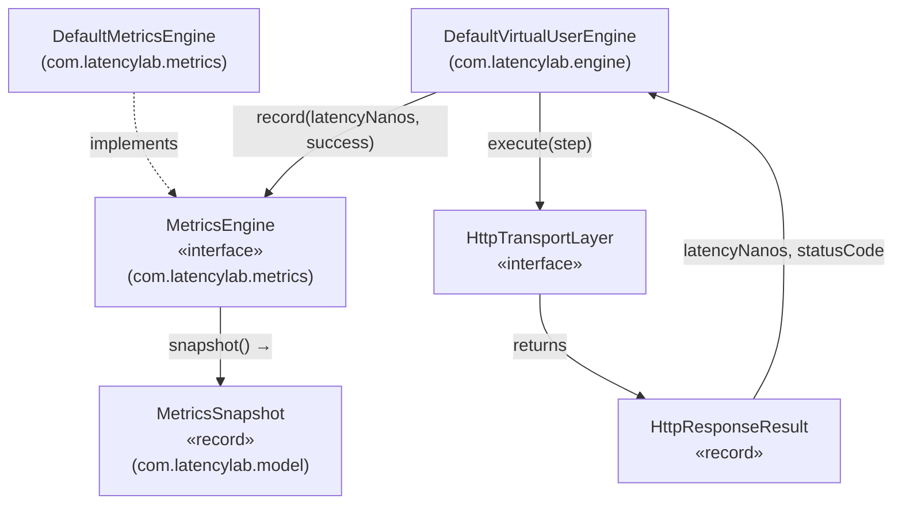

# Design Document — LatencyLab Phase 4: Metrics Aggregation

## Overview

Phase 4 delivers `DefaultMetricsEngine` — the concrete implementation of the `MetricsEngine` interface defined in Phase 1. It receives per-request outcomes from concurrent virtual threads (via `record`), aggregates them in real time using lock-free atomic operations, and produces point-in-time `MetricsSnapshot` values on demand (via `snapshot`).

The implementation is designed around three guiding principles:

1. **Lock-free concurrency** — all hot-path operations in `record` use `AtomicLong` primitives (addAndGet for sum, CAS loops for min/max) and `CopyOnWriteArrayList` for the latency buffer, avoiding any synchronized blocks on the recording path.
2. **Snapshot-on-demand** — `snapshot()` performs a local copy of the buffer, sorts it, and computes all derived statistics (avg, percentiles, RPS) at call time; no background aggregation threads are needed.
3. **Zero-state safety** — when no records have been made, `snapshot()` returns an all-zero `MetricsSnapshot` without any division-by-zero or index-out-of-bounds risk.

Phase 4 integrates directly with Phase 3's `DefaultVirtualUserEngine`, which already calls `MetricsEngine.record(result.latencyNanos(), success)` for every completed HTTP request. No changes to `DefaultVirtualUserEngine` are required.

---

## Architecture

### Component Diagram



### Data Flow

```
Virtual Thread N
    │
    ▼
DefaultVirtualUserEngine.runUser(user, scenario)
    │  transport.execute(step) → HttpResponseResult
    │  success = statusCode in [200, 299]
    ▼
DefaultMetricsEngine.record(latencyNanos, success)
    ├── totalCounter.incrementAndGet()
    ├── successCounter / failureCounter.incrementAndGet()
    ├── runningSum.addAndGet(latencyNanos)
    ├── CAS loop → update runningMin
    ├── CAS loop → update runningMax
    └── latencyBuffer.add(latencyNanos)

                    ┌─────────────────────────────────┐
                    │  DefaultMetricsEngine.snapshot() │
                    │  ─────────────────────────────── │
                    │  1. Read all AtomicLong values    │
                    │  2. Copy buffer to long[]         │
                    │  3. Arrays.sort(copy)             │
                    │  4. Compute avg, percentiles, RPS │
                    │  5. Construct MetricsSnapshot     │
                    └─────────────────────────────────┘
                                    │
                                    ▼
                            MetricsSnapshot
```

---

## Components and Interfaces

### `DefaultMetricsEngine` (new class)

**Package:** `com.latencylab.metrics`  
**Implements:** `MetricsEngine`

This is the sole new production type introduced in Phase 4.

#### Class Declaration

```java
public class DefaultMetricsEngine implements MetricsEngine {
    private static final Logger log = LoggerFactory.getLogger(DefaultMetricsEngine.class);

    private final AtomicLong totalCounter    = new AtomicLong(0);
    private final AtomicLong successCounter  = new AtomicLong(0);
    private final AtomicLong failureCounter  = new AtomicLong(0);
    private final AtomicLong runningSum      = new AtomicLong(0);
    private final AtomicLong runningMin      = new AtomicLong(Long.MAX_VALUE);
    private final AtomicLong runningMax      = new AtomicLong(0);
    private final CopyOnWriteArrayList<Long> latencyBuffer = new CopyOnWriteArrayList<>();
    private final long startTimestamp;

    public DefaultMetricsEngine() {
        this.startTimestamp = System.nanoTime();
        log.debug("DefaultMetricsEngine initialized, startTimestamp={}", startTimestamp);
    }
}
```

#### `record(long latencyNanos, boolean success)`

The hot path. Called from virtual threads concurrently.

```
record(latencyNanos, success):
  1. if latencyNanos < 0 → throw IllegalArgumentException("latencyNanos must be >= 0, got: " + latencyNanos)
  2. totalCounter.incrementAndGet()
  3. if success → successCounter.incrementAndGet()
     else       → failureCounter.incrementAndGet()
  4. runningSum.addAndGet(latencyNanos)
  5. CAS loop for min:
       while (latencyNanos < runningMin.get())
           if runningMin.compareAndSet(current, latencyNanos) → break
  6. CAS loop for max:
       while (latencyNanos > runningMax.get())
           if runningMax.compareAndSet(current, latencyNanos) → break
  7. latencyBuffer.add(latencyNanos)
  8. log.debug("record: latencyNanos={}, success={}", latencyNanos, success)
```

**Thread-safety rationale:**
- Steps 2–4 use `AtomicLong.incrementAndGet` / `addAndGet` — these are single atomic operations, no lost updates possible.
- Steps 5–6 use CAS loops — the standard lock-free pattern for running min/max. Each iteration re-reads the current value, so a concurrent update that already set a smaller/larger value will cause the loop to exit without overwriting.
- Step 7 uses `CopyOnWriteArrayList.add` — thread-safe by contract; no data loss under concurrent appends.

#### `snapshot()`

Called on demand (typically from the reporting layer or test assertions).

```
snapshot():
  1. snapshotTimestamp = System.nanoTime()
  2. total   = totalCounter.get()
  3. success = successCounter.get()
  4. failure = failureCounter.get()
  5. sum     = runningSum.get()
  6. if total == 0 → return zero-state MetricsSnapshot (all fields 0, RPS 0.0)
  7. avg = sum / total  (integer division)
  8. min = runningMin.get()
  9. max = runningMax.get()
  10. copy buffer to long[] arr; Arrays.sort(arr); n = arr.length
  11. p50 = arr[(int) Math.floor(0.50 * n)]
      p95 = arr[(int) Math.floor(0.95 * n)]
      p99 = arr[(int) Math.floor(0.99 * n)]
  12. elapsed = (System.nanoTime() - startTimestamp) / 1_000_000_000.0
      rps = (elapsed > 0.0) ? (double) total / elapsed : 0.0
  13. log.debug("snapshot: totalRequests={}, requestsPerSecond={}", total, rps)
  14. return new MetricsSnapshot(total, success, failure, avg, min, max, p50, p95, p99, rps, snapshotTimestamp)
```

**Zero-state handling:** When `total == 0`, `runningMin` is `Long.MAX_VALUE` and `runningMax` is `0`. Rather than returning these sentinel values, the method short-circuits and returns all zeros. This avoids confusing output and satisfies the `MetricsSnapshot` invariant (`successfulRequests + failedRequests <= totalRequests`).

**Snapshot consistency note:** Steps 2–9 read each atomic independently. Under concurrent recording, a `record()` call may interleave between reads. This is an intentional design trade-off: `snapshot()` does not acquire any lock, so it reflects a "best-effort consistent" view. The counter invariant (`success + failure == total`) is guaranteed to hold in the snapshot because `totalCounter` is incremented first in `record()`, and the snapshot reads `total` first — any partial update will show `total` as the leading value, which is safe for `MetricsSnapshot`'s constructor invariant.

---

### `MetricsEngine` (unchanged)

The Phase 1 interface remains unchanged:

```java
public interface MetricsEngine {
    void record(long latencyNanos, boolean success);
    MetricsSnapshot snapshot();
}
```

### `DefaultVirtualUserEngine` (unchanged)

No modifications required. The existing call site in `runUser`:

```java
boolean success = result.statusCode() >= 200 && result.statusCode() <= 299;
metricsEngine.record(result.latencyNanos(), success);
```

already provides the correct arguments. Phase 4 simply provides the implementation that makes those calls meaningful.

---

## Data Models

No new data models are introduced in Phase 4. The existing `MetricsSnapshot` record (Phase 1) is the sole output type of `snapshot()`.

### `MetricsSnapshot` (existing, unchanged)

```java
public record MetricsSnapshot(
    long totalRequests,
    long successfulRequests,
    long failedRequests,
    long avgLatencyNanos,
    long minLatencyNanos,
    long maxLatencyNanos,
    long p50LatencyNanos,
    long p95LatencyNanos,
    long p99LatencyNanos,
    double requestsPerSecond,
    long snapshotTimestamp
) {
    public MetricsSnapshot {
        if (successfulRequests < 0 || failedRequests < 0 || totalRequests < 0)
            throw new IllegalArgumentException("Request counts cannot be negative");
        if (totalRequests - successfulRequests < failedRequests)
            throw new IllegalArgumentException(
                "successfulRequests + failedRequests cannot exceed totalRequests");
    }
}
```

### Internal State Summary

| Field | Type | Initial Value | Purpose |
|---|---|---|---|
| `totalCounter` | `AtomicLong` | `0` | Counts every `record()` call |
| `successCounter` | `AtomicLong` | `0` | Counts `record(..., true)` calls |
| `failureCounter` | `AtomicLong` | `0` | Counts `record(..., false)` calls |
| `runningSum` | `AtomicLong` | `0` | Accumulates sum of all `latencyNanos` values |
| `runningMin` | `AtomicLong` | `Long.MAX_VALUE` | Tracks minimum `latencyNanos` seen |
| `runningMax` | `AtomicLong` | `0` | Tracks maximum `latencyNanos` seen |
| `latencyBuffer` | `CopyOnWriteArrayList<Long>` | empty | Stores all samples for percentile computation |
| `startTimestamp` | `long` | `System.nanoTime()` at construction | Reference point for RPS elapsed time |

---

## Correctness Properties

*A property is a characteristic or behavior that should hold true across all valid executions of a system — essentially, a formal statement about what the system should do. Properties serve as the bridge between human-readable specifications and machine-verifiable correctness guarantees.*

This feature involves concurrent atomic counters, statistical aggregation over arbitrary data sets, and percentile computation — all well-suited for property-based testing. The chosen PBT library is **[jqwik](https://jqwik.net/)** (already in `pom.xml` at version 1.8.4, JUnit 5 compatible). Each property test runs a minimum of 100 iterations.

**Property Reflection — Redundancy Check:**

- Properties about total/success/failure counter invariants (Req 2.1, 2.2, 5.1, 5.2, 5.3) share the same core invariant — merged into one property covering counter consistency.
- Properties about avg/min/max ordering (Req 3.7) and percentile ordering (Req 3.8) are distinct mathematical invariants — kept separate but combined into one "latency ordering invariant" property since they both test ordering relationships on the same snapshot.
- Properties about concurrent recording correctness (Req 2.1, 7.1) are distinct from single-threaded statistical correctness — kept separate.
- Properties about snapshot idempotency (Req 6.2, 6.5) are distinct from counter invariants — kept separate.
- Properties about RPS non-negativity (Req 4.5) are a simple invariant over any input — kept as a standalone property.
- Properties about percentile index formula correctness (Req 3.4) are testable over arbitrary sorted arrays — kept as a standalone property.
- Properties about min/max correctness (Req 3.2, 3.3) are distinct from ordering — kept as a standalone property verifying exact values.

After reflection, 7 unique properties remain.

---

### Property 1: Counter consistency invariant

*For any* sequence of N calls to `record(latencyNanos, success)` with arbitrary non-negative `latencyNanos` values and arbitrary `success` flags, after all calls complete, `snapshot().totalRequests` SHALL equal N, `snapshot().successfulRequests` SHALL equal the count of `true` flags, `snapshot().failedRequests` SHALL equal the count of `false` flags, and `successfulRequests + failedRequests` SHALL equal `totalRequests`.

**Validates: Requirements 2.1, 2.2, 5.1, 5.2, 5.3**

---

### Property 2: Latency ordering invariant — min ≤ avg ≤ max and P50 ≤ P95 ≤ P99

*For any* non-empty list of non-negative latency values recorded via `record`, the returned `MetricsSnapshot` SHALL satisfy `minLatencyNanos <= avgLatencyNanos`, `avgLatencyNanos <= maxLatencyNanos`, `p50LatencyNanos <= p95LatencyNanos`, and `p95LatencyNanos <= p99LatencyNanos`.

**Validates: Requirements 3.7, 3.8**

---

### Property 3: Percentile index formula correctness

*For any* sorted `long[]` array of length N (N ≥ 1) with values in [0, Long.MAX_VALUE], the percentile at rank R (where R ∈ {0.50, 0.95, 0.99}) computed as `array[(int) Math.floor(R * N)]` SHALL produce an index in [0, N-1], and the value at that index SHALL be ≥ `array[0]` and ≤ `array[N-1]`.

**Validates: Requirement 3.4**

---

### Property 4: Thread-safe concurrent recording — no lost updates

*For any* `threadCount` in [2, 50] and `recordsPerThread` in [1, 100], when `threadCount` virtual threads each call `record(1000L, true)` exactly `recordsPerThread` times concurrently, after all threads complete, `snapshot().totalRequests` SHALL equal `threadCount × recordsPerThread` and `snapshot().successfulRequests` SHALL equal `threadCount × recordsPerThread` with no lost increments.

**Validates: Requirements 2.1, 2.3, 7.1**

---

### Property 5: RPS is non-negative and finite for all valid inputs

*For any* number of `record` calls (including zero), `snapshot().requestsPerSecond` SHALL be greater than or equal to `0.0`, SHALL NOT be `Double.NaN`, and SHALL NOT be `Double.POSITIVE_INFINITY` or `Double.NEGATIVE_INFINITY`.

**Validates: Requirements 4.3, 4.5**

---

### Property 6: Snapshot idempotency — repeated snapshots without new records return equivalent data

*For any* sequence of N `record` calls, calling `snapshot()` twice in succession with no intervening `record` calls SHALL return two `MetricsSnapshot` instances where `totalRequests`, `successfulRequests`, `failedRequests`, `avgLatencyNanos`, `minLatencyNanos`, `maxLatencyNanos`, `p50LatencyNanos`, `p95LatencyNanos`, and `p99LatencyNanos` are all equal between the two snapshots.

**Validates: Requirements 6.2, 6.5**

---

### Property 7: Min and max correctness — exact values from recorded set

*For any* non-empty list of non-negative latency values L recorded via `record`, `snapshot().minLatencyNanos` SHALL equal `Collections.min(L)` and `snapshot().maxLatencyNanos` SHALL equal `Collections.max(L)`.

**Validates: Requirements 3.2, 3.3**

---

## Error Handling

| Location | Condition | Behavior |
|---|---|---|
| `record(latencyNanos, success)` | `latencyNanos < 0` | Throw `IllegalArgumentException` with message containing `"latencyNanos"` and the received value; no internal state is modified |
| `snapshot()` | `totalCounter == 0` (zero state) | Return all-zero `MetricsSnapshot`; no exception; no division by zero |
| `snapshot()` | `elapsedSeconds == 0` | Set `requestsPerSecond = 0.0`; no division by zero |
| `snapshot()` | `latencyBuffer` is empty at snapshot time | Handled by zero-state check before percentile computation |
| `MetricsSnapshot` constructor | `successfulRequests + failedRequests > totalRequests` | `IllegalArgumentException` from record constructor (should never occur in correct implementation) |

**Design note on negative latency:** `latencyNanos` values come from `System.nanoTime()` deltas measured in `OkHttpTransportLayer`. These are always non-negative in correct usage. The guard in `record()` is a defensive contract boundary — it prevents corrupted state if a buggy transport layer passes a negative value.

---

## Testing Strategy

### Unit Tests (JUnit 5) — `DefaultMetricsEngineTest`

Located in `com.latencylab.metrics` under `src/test/java`.

| Test Method | What It Verifies |
|---|---|
| `testZeroStateSnapshot` | `snapshot()` on a fresh engine returns all-zero fields |
| `testSingleRecord` | After `record(1000L, true)`, all latency fields equal 1000, `totalRequests == 1`, `successfulRequests == 1` |
| `testRecordIncrementsTotalRequests` | Each `record()` call increments `totalRequests` by 1 |
| `testSuccessFailureCounting` | `record(x, true)` increments `successfulRequests`; `record(x, false)` increments `failedRequests` |
| `testCounterSumInvariant` | After mixed success/failure records, `totalRequests == successfulRequests + failedRequests` |
| `testNegativeLatencyThrows` | `record(-1L, true)` throws `IllegalArgumentException` |
| `testZeroLatencyAccepted` | `record(0L, true)` does not throw; `minLatencyNanos == 0` |
| `testLongMaxValueAccepted` | `record(Long.MAX_VALUE, true)` does not throw; `maxLatencyNanos == Long.MAX_VALUE` |
| `testSnapshotTimestampIsRecent` | `snapshotTimestamp` is between `nanoTime()` calls bracketing `snapshot()` |
| `testThreadSafety50VirtualThreads` | 50 virtual threads each call `record(1000L, true)` once; `totalRequests == 50`, `successfulRequests == 50` |

### Compliance Tests (JUnit 5) — `DefaultMetricsEngineComplianceTest`

Located in `com.latencylab.metrics` under `src/test/java`.

| Test Method | What It Verifies |
|---|---|
| `testImplementsMetricsEngine` | `MetricsEngine.class.isAssignableFrom(DefaultMetricsEngine.class)` returns `true` |
| `testSnapshotDoesNotResetState` | Two consecutive `snapshot()` calls return equal statistical fields |
| `testRpsIsNonNegative` | `requestsPerSecond >= 0.0` after various record sequences |
| `testAvgIsIntegerDivision` | `avgLatencyNanos == sum / count` (integer division) for a known sequence |

### Property-Based Tests (jqwik) — `DefaultMetricsEnginePropertyTest`

Located in `com.latencylab.metrics` under `src/test/java`.

Each `@Property` method runs with `@Property(tries = 100)` minimum. Each test is tagged with a comment referencing the design property.

| Test Method | Property | jqwik Generators |
|---|---|---|
| `counterConsistencyInvariant` | Property 1 | `@ForAll List<@From("latencySuccessPairs") Pair>` |
| `latencyOrderingInvariant` | Property 2 | `@ForAll @NotEmpty List<@LongRange(min=0) Long>` |
| `percentileIndexFormula` | Property 3 | `@ForAll @Size(min=1) long[]` (sorted in test body) |
| `threadSafeNoConcurrentLostUpdates` | Property 4 | `@ForAll @IntRange(min=2, max=50) int threadCount`, `@ForAll @IntRange(min=1, max=100) int recordsPerThread` |
| `rpsIsNonNegativeAndFinite` | Property 5 | `@ForAll @IntRange(min=0, max=200) int recordCount` |
| `snapshotIdempotency` | Property 6 | `@ForAll @NotEmpty List<@LongRange(min=0) Long>` |
| `minMaxCorrectnessExactValues` | Property 7 | `@ForAll @NotEmpty List<@LongRange(min=0) Long>` |

**Tag format for each property test:**
```java
// Feature: latencylab-phase4-metrics-aggregation, Property N: <property_text>
```

### Integration Tests — `DefaultMetricsEngineIntegrationTest`

Located in `com.latencylab.metrics` under `src/test/java`. Uses a mock `HttpTransportLayer` (anonymous class or simple stub — no Mockito required).

| Test Method | What It Verifies |
|---|---|
| `testEndToEndNxKRequests` | `DefaultVirtualUserEngine` with N users × K steps → `totalRequests == N*K` |
| `testMixedStatusCodeCounting` | Transport returns mix of 200 and 500 responses → correct success/failure split |
| `testMinMaxFromTransportResults` | `minLatencyNanos` and `maxLatencyNanos` match min/max of transport-returned latencies |

### Build Verification

- `mvn verify` on a clean checkout exits `BUILD SUCCESS`.
- `failIfNoTests=true` enforced in Maven Surefire (already configured).
- Required test classes that must exist: `DefaultMetricsEngineTest`, `DefaultMetricsEngineComplianceTest`.
- Compiler flags `-Xlint:unchecked -Xlint:deprecation` already configured; no new warnings should be introduced.

---

## Complete Type Inventory for Phase 4

| Type | Kind | Package | Phase 4 Status |
|---|---|---|---|
| `DefaultMetricsEngine` | class | `com.latencylab.metrics` | **New — implemented** |
| `MetricsEngine` | interface | `com.latencylab.metrics` | Unchanged (Phase 1) |
| `MetricsSnapshot` | record | `com.latencylab.model` | Unchanged (Phase 1) |
| `DefaultVirtualUserEngine` | class | `com.latencylab.engine` | Unchanged (Phase 3) |
| `DefaultMetricsEngineTest` | test class | `com.latencylab.metrics` | **New — required** |
| `DefaultMetricsEngineComplianceTest` | test class | `com.latencylab.metrics` | **New — required** |
| `DefaultMetricsEnginePropertyTest` | test class | `com.latencylab.metrics` | **New — recommended** |
| `DefaultMetricsEngineIntegrationTest` | test class | `com.latencylab.metrics` | **New — recommended** |
